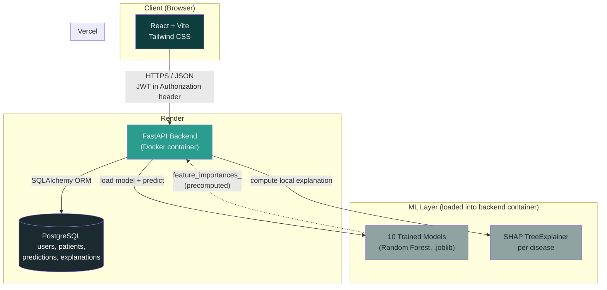

# System Architecture — Clarity Care AI


```mermaid
flowchart TB
    subgraph Client["Client (Browser)"]
        UI["React + Vite<br/>Tailwind CSS"]
    end

    subgraph Vercel["Vercel"]
        UI
    end

    subgraph Render["Render"]
        API["FastAPI Backend<br/>(Docker container)"]
        DB[("PostgreSQL<br/>users, patients,<br/>predictions, explanations")]
    end

    subgraph MLLayer["ML Layer (loaded into backend container)"]
        Models["10 Trained Models<br/>(Random Forest, .joblib)"]
        SHAP["SHAP TreeExplainer<br/>per disease"]
    end

    UI -- "HTTPS / JSON<br/>JWT in Authorization header" --> API
    API -- "SQLAlchemy ORM" --> DB
    API -- "load model + predict" --> Models
    API -- "compute local explanation" --> SHAP
    Models -.->|"feature_importances_<br/>(precomputed)"| API

    style UI fill:#0F3D3E,color:#F4F7F5
    style API fill:#2A9D8F,color:#F4F7F5
    style DB fill:#1B2A2E,color:#F4F7F5
    style Models fill:#8FA3A0,color:#1B2A2E
    style SHAP fill:#8FA3A0,color:#1B2A2E
```

## Request flow — a single prediction

```mermaid
sequenceDiagram
    participant P as Patient (Browser)
    participant F as React Frontend