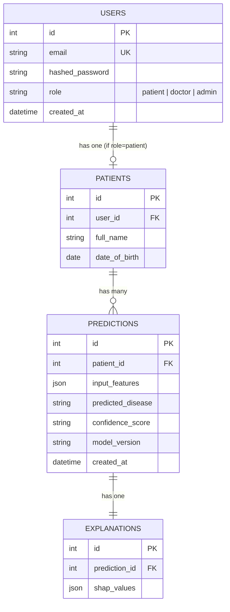

# Database Schema — Clarity Care AI

## Notes on design decisions

- **`users` and `patients` are separate tables** (1-to-1, not merged) — keeps authentication concerns (email, password, role) separate from clinical data (name, DOB), and means doctor/admin accounts don't carry unused patient-only columns.
- **`input_features` and `shap_values` are stored as `JSON`**, not normalized into separate columns — each of the 10 diseases has a different, fixed feature schema, so a flexible JSON column avoids needing 10 different prediction table variants while still keeping the *relationships* (patient → predictions → explanation) fully relational.
- **`predictions.confidence_score` is stored as a string, not a float** — a pragmatic choice made early (Phase 5) to sidestep floating-point precision/serialization inconsistencies across the stack; worth noting as a possible refinement (e.g. `Numeric` type) in a "future work" section of the report.
- **One `explanation` per `prediction`** (1-to-1) — each prediction gets exactly one SHAP explanation computed at creation time; there's no versioning of explanations independent of the prediction they belong to.